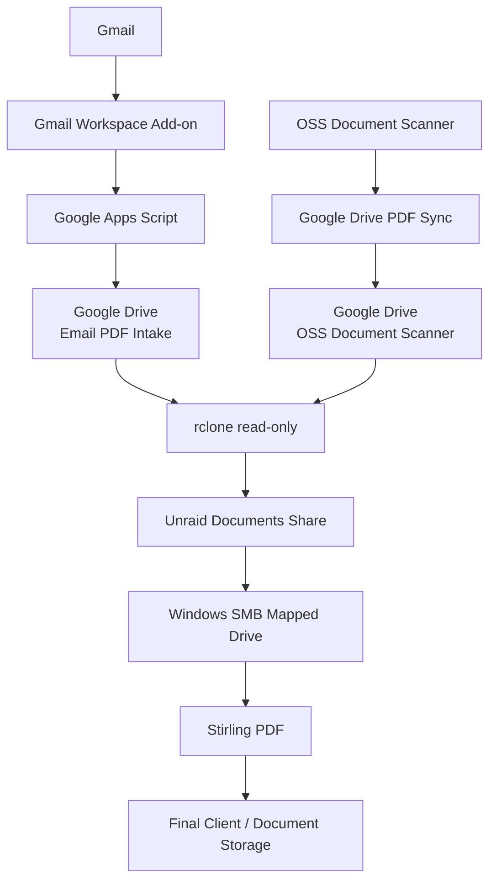
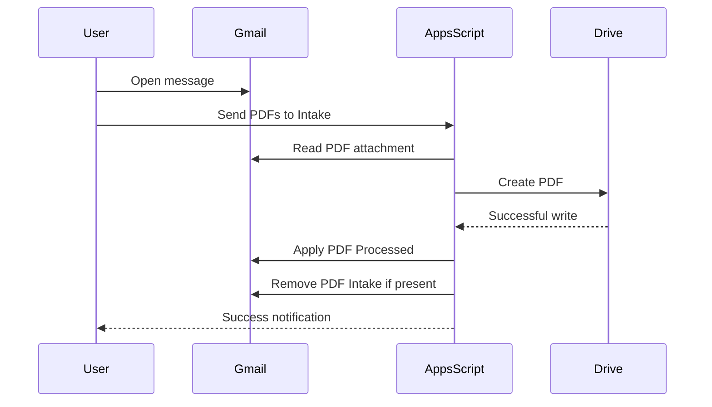

# Stirling Document Workflow

Self-hosted PDF intake and processing workflow using **Stirling PDF**, **Unraid**, **Gmail**, **Google Apps Script**, **OSS Document Scanner**, **Google Drive**, and **rclone**.

The goal of this project is to make PDFs received by email or created on a phone available in a local document archive with minimal manual handling, while keeping the processing environment self-hosted and the local archive independent from cloud deletion behavior.

---

## Project Goals

The system was designed around several practical requirements:

- Self-host the PDF processing environment.
- Keep the permanent document archive on local storage.
- Support PDFs received through Gmail.
- Support field and office scanning from a phone.
- Make new PDFs available quickly without manually downloading and moving files.
- Avoid exposing Unraid directly to the Internet for document intake.
- Avoid giving Unraid write access to Google Drive.
- Avoid synchronization behavior that could propagate cloud deletions into the local archive.
- Minimize OAuth permissions where practical.
- Preserve a simple Windows workflow for day-to-day document work.

The final design treats **Google Drive as a transport layer**, **Unraid as the archive**, and **Stirling PDF as the processing toolbench**.

---

# Architecture



Two independent intake paths converge at the Unraid document archive.

---

# Components

| Component | Function |
|---|---|
| **Stirling PDF** | Self-hosted PDF processing environment |
| **Unraid** | Docker host and persistent document archive |
| **OSS Document Scanner** | Mobile document capture |
| **Gmail** | Email document intake |
| **Google Apps Script** | Extracts PDF attachments and manages Gmail workflow |
| **Google Drive** | Temporary transport layer |
| **rclone** | Pulls cloud documents into Unraid |
| **SMB** | Makes the Unraid archive available to Windows |
| **Windows** | Primary workstation environment |

---

# Stirling PDF

Stirling PDF runs as a Docker container on Unraid.

Current deployment:

```text
Container: StirlingPDF
Image: docker.stirlingpdf.com/stirlingtools/stirling-pdf:latest
Port: 8080
```

Persistent storage is mapped outside the container:

```text
/configs
/logs
/pipeline
/usr/share/tessdata
/customFiles
```

Example Unraid paths:

```text
/mnt/user/appdata/stirling-pdf/configs
/mnt/user/appdata/stirling-pdf/logs
/mnt/user/appdata/stirling-pdf/pipeline
/mnt/user/appdata/stirling-pdf/tessdata
/mnt/user/appdata/stirling-pdf/customFiles
```

Important environment settings include:

```text
SECURITY_ENABLELOGIN=true
SYSTEM_DEFAULTLOCALE=en-US
SYSTEM_GOOGLEVISIBILITY=false
SYSTEM_ENABLEANALYTICS=false
```

Authentication is enabled and the Stirling instance is intended to remain a private internal service rather than a public Internet endpoint.

---

# Why Stirling Is Not the Archive

One of the most important design decisions was **not** to make Stirling responsible for ingesting or storing original documents.

Stirling is treated as a **toolbench**, not the authoritative repository.

The archive remains:

```text
Unraid
└── Documents
    ├── Email PDF Intake
    └── OSS Document Scanner
```

This keeps document storage independent from Stirling itself. Stirling can be upgraded, rebuilt, replaced, or temporarily unavailable without affecting the archived source PDFs.

It also avoids automatically rewriting every incoming document through OCR, compression, conversion, or other processing. Documents are modified only when there is a reason to modify them.

---

# Gmail PDF Intake

Email was the more interesting intake problem.

The desired workflow was to open an email containing a PDF and move that attachment into the document system without manually:

1. downloading it,
2. locating the download,
3. copying it to the server,
4. cleaning up the temporary copy.

The solution is a small **Google Workspace Gmail add-on** backed by **Google Apps Script**.

When a Gmail message is open, the add-on presents:

```text
Email PDF Intake
```

with a button:

```text
Send PDFs to Intake
```

Pressing the button processes the current message immediately.



The sequencing is deliberate: the message is **not marked processed until the Drive write succeeds**.

---

# Gmail Labels

Two Gmail labels are used:

```text
PDF Intake
PDF Processed
```

## `PDF Processed`

The normal Gmail add-on workflow applies `PDF Processed` immediately after the PDF has successfully been copied to Google Drive.

## `PDF Intake`

`PDF Intake` provides a fallback mechanism.

A user can manually apply the label:

```text
PDF Intake
```

A one-minute Apps Script trigger then:

1. finds the labeled thread,
2. extracts PDF attachments,
3. copies them to Google Drive,
4. removes `PDF Intake`, and
5. applies `PDF Processed`.

This provides both an immediate interactive path and an asynchronous fallback path.

---

# Gmail Add-on Manifest

The Apps Script project uses the Gmail and Drive advanced services.

The working `appsscript.json` configuration is:

```json
{
  "timeZone": "America/New_York",
  "dependencies": {
    "enabledAdvancedServices": [
      {
        "userSymbol": "Gmail",
        "version": "v1",
        "serviceId": "gmail"
      },
      {
        "userSymbol": "Drive",
        "version": "v3",
        "serviceId": "drive"
      }
    ]
  },
  "oauthScopes": [
    "https://www.googleapis.com/auth/gmail.modify",
    "https://www.googleapis.com/auth/gmail.addons.execute",
    "https://www.googleapis.com/auth/gmail.addons.current.message.readonly",
    "https://www.googleapis.com/auth/drive.file"
  ],
  "addOns": {
    "common": {
      "name": "Email PDF Intake",
      "logoUrl": "https://www.gstatic.com/images/branding/productlogos/gsuite_addons/v6/web-24dp/logo_gsuite_addons_color_1x_web_24dp.png"
    },
    "gmail": {
      "contextualTriggers": [
        {
          "unconditional": {},
          "onTriggerFunction": "onGmailMessageOpen"
        }
      ]
    }
  },
  "exceptionLogging": "STACKDRIVER",
  "runtimeVersion": "V8"
}
```

---

# OAuth Design

The first implementation used the high-level Apps Script `GmailApp` and `DriveApp` services.

That resulted in Google requesting permissions roughly equivalent to:

```text
Read, compose, send, and permanently delete all Gmail
See, edit, create, and delete all Google Drive files
```

That was more access than this application required.

The implementation was changed to use the advanced Gmail and Drive APIs with explicit OAuth scopes.

## Drive

The project uses:

```text
https://www.googleapis.com/auth/drive.file
```

rather than unrestricted Drive access.

This allows the application to manage the files and folder it creates instead of receiving general access to the account's entire Drive.

## Gmail

The project uses:

```text
https://www.googleapis.com/auth/gmail.modify
```

because it must both read attachments and modify Gmail labels.

The Gmail permission remains broader than read-only, but avoids the full-mail scope that allows immediate permanent deletion.

---

# Google Drive Folder Ownership

Because Apps Script uses the restricted `drive.file` scope, the script creates its own destination folder:

```text
Email PDF Intake
```

The resulting folder ID is stored in Apps Script Script Properties as:

```text
EMAIL_PDF_INTAKE_FOLDER_ID
```

This avoids requiring unrestricted Drive access simply to search for and manage an arbitrary pre-existing folder.

---

# Duplicate Protection

The Gmail workflow records successfully transferred attachments in Script Properties.

Each processed attachment creates a key resembling:

```text
pdf:<MESSAGE_ID>:<ATTACHMENT_ID>
```

Before writing an attachment, the script checks for that property.

This prevents duplicate PDFs when:

- the Gmail button is clicked twice;
- a message is processed by the button and later receives `PDF Intake`;
- the one-minute fallback trigger repeatedly sees the same thread.

The button and fallback workflows therefore share the same deduplication mechanism.

---

# OSS Document Scanner

The second intake path uses the open-source **OSS Document Scanner** mobile application.

The application performs the scan and generates the PDF locally on the phone.

Configured features include:

```text
Google Drive PDF Sync: Enabled
OCR: Enabled
Quality: Best
Language: English
```

The Google Drive destination is:

```text
OSS Document Scanner
```

Delete-after-sync is disabled.

The phone sends the generated PDF to Google Drive without requiring direct SMB, VPN, or Unraid connectivity. This is particularly useful for field scanning.

---

# Why Google Drive Is in the Middle

An obvious alternative would be to send the scanner or Gmail attachment directly to Unraid.

Google Drive solves several practical problems simultaneously:

- The phone can upload from anywhere it has Internet access.
- Gmail and Apps Script integrate naturally with Drive.
- Neither workflow requires inbound connectivity to the local network.
- Unraid does not need to expose an upload service publicly.

The resulting trust direction is:

```text
Internet-facing applications
          |
          v
     Google Drive
          |
      outbound pull
          |
          v
        Unraid
```

Unraid pulls documents outward rather than accepting unsolicited inbound document-transfer connections.

---

# rclone

Unraid retrieves documents from Google Drive using `rclone`.

The configured remote is:

```text
gdrive:
```

The persistent configuration is stored at:

```text
/boot/config/rclone/rclone.conf
```

The Google Drive remote uses:

```text
drive.readonly
```

This is intentional. Unraid needs to retrieve documents from Google Drive; it does not need permission to modify or delete them.

---

# Why `rclone copy` Instead of `rclone sync`

Both transfer jobs use:

```bash
rclone copy
```

not:

```bash
rclone sync
```

This is a significant archival design decision.

`sync` attempts to make the destination mirror the source. In an archival workflow, that can be dangerous: deleting a cloud document could cause a future sync operation to remove the local copy as well.

`copy` provides the desired behavior:

```text
Cloud file added
      ↓
Local copy created

Cloud file deleted later
      ↓
Local archive remains
```

Unraid therefore acts as the persistent side of the system.

---

# Email PDF rclone Job

The Email PDF Intake transfer script is:

```bash
#!/bin/bash

rclone copy \
  "gdrive:Email PDF Intake" \
  "/mnt/user/Documents/Email PDF Intake" \
  --config "/boot/config/rclone/rclone.conf" \
  --log-level INFO
```

It runs every minute:

```cron
* * * * *
```

---

# Scanner rclone Job

The OSS Document Scanner transfer script is:

```bash
#!/bin/bash

rclone copy \
  "gdrive:OSS Document Scanner" \
  "/mnt/user/Documents/OSS Document Scanner" \
  --config "/boot/config/rclone/rclone.conf" \
  --log-level INFO
```

It also runs every minute:

```cron
* * * * *
```

The scanner workflow does not necessarily require that frequency for field work, but one-minute polling makes office scanning effectively immediate without requiring a user to log into Unraid and manually run the transfer.

Most executions simply perform a lightweight comparison and exit:

```text
INFO : There was nothing to transfer
```

---

# Local Archive

The local document destinations are:

```text
/mnt/user/Documents/Email PDF Intake
/mnt/user/Documents/OSS Document Scanner
```

These directories are exposed through the existing Unraid `Documents` SMB share.

On the Windows workstation, that share is mapped as a network drive. Day-to-day users therefore work with ordinary File Explorer rather than directly interacting with Docker volumes, rclone, or the Unraid management interface.

---

# Practical Workflow

The goal is for the infrastructure to disappear during normal use.

## Email

```text
Open Gmail
    ↓
Open message
    ↓
Email PDF Intake
    ↓
Send PDFs to Intake
    ↓
~1 minute maximum
    ↓
PDF appears in mapped Documents drive
    ↓
Open Stirling PDF
```

## Scanner

```text
Scan document
    ↓
Save PDF
    ↓
OSS Document Scanner uploads to Drive
    ↓
~1 minute maximum
    ↓
PDF appears in mapped Documents drive
    ↓
Open Stirling PDF
```

---

# Using Stirling

Stirling is used on demand for operations such as:

- merging PDFs;
- removing or rearranging pages;
- splitting documents;
- OCR;
- compression;
- redaction;
- signing;
- watermarking;
- metadata editing;
- PDF conversion;
- extraction workflows;
- document cleanup.

The archived source document is not automatically modified.

A document is pulled from the mapped archive, processed as necessary in Stirling, and the finished document is saved into its appropriate permanent client or business file.

---

# Security Model

The system follows several simple principles.

## No public Stirling endpoint

Stirling remains an internal service.

## No inbound Unraid document-transfer service

Google Drive serves as the external transport mechanism.

## Read-only cloud access from Unraid

rclone uses:

```text
drive.readonly
```

## Restricted Drive access from Apps Script

Apps Script uses:

```text
drive.file
```

rather than unrestricted Drive access.

## No cloud-to-local deletion propagation

`rclone copy` is used rather than `sync`.

## Authentication enabled in Stirling

The Stirling interface requires authentication.

## OAuth credentials remain private

The production rclone configuration contains credential material and should never be committed to the repository.

Recommended `.gitignore` entries:

```gitignore
rclone.conf
*.token
*.credentials
.env
```

---

# Failure Isolation

The modular architecture makes troubleshooting relatively straightforward.

## Gmail PDF does not appear in Google Drive

Problem area:

```text
Gmail
↓
Apps Script
↓
Drive
```

Check Apps Script **Executions**.

## PDF exists in Drive but not Unraid

Problem area:

```text
Drive
↓
rclone
↓
Unraid
```

Test:

```bash
rclone ls "gdrive:Email PDF Intake" \
  --config "/boot/config/rclone/rclone.conf"
```

or:

```bash
rclone ls "gdrive:OSS Document Scanner" \
  --config "/boot/config/rclone/rclone.conf"
```

## rclone sees the PDF but automatic transfer fails

Run the relevant command manually:

```bash
rclone copy \
  "gdrive:Email PDF Intake" \
  "/mnt/user/Documents/Email PDF Intake" \
  --config "/boot/config/rclone/rclone.conf" \
  -P
```

If that succeeds, the problem is probably the Unraid User Scripts schedule rather than rclone itself.

## PDF exists on Unraid but not Windows

The document-transfer chain is already working. Troubleshoot SMB or the Windows drive mapping separately.

## Scanner file never reaches Drive

The failure is upstream of Unraid. Check:

```text
OSS Document Scanner
Google authentication
Google Drive PDF Sync
Auto Sync
Remote folder
```

---

# One Interesting Apps Script Problem

During development, Gmail attachment handling initially used:

```javascript
Utilities.base64DecodeWebSafe(attachmentData.data);
```

This produced:

```text
Exception: Could not decode string.
```

Treating `attachmentData.data` as a JavaScript string then produced:

```text
TypeError:
(attachmentData.data || "").replace is not a function
```

With the Apps Script Advanced Gmail service used in this environment, the working implementation was simply:

```javascript
const bytes = attachmentData.data;
```

followed by:

```javascript
const blob = Utilities.newBlob(
  bytes,
  'application/pdf',
  attachment.filename
);
```

That behavior is worth documenting because it is not obvious if approaching the implementation directly from the Gmail REST API representation.

---

# Recovery Documentation

A separate operational recovery document is stored on the Unraid boot device:

```text
/boot/config/rclone/DOCUMENT_TRANSFER_README.txt
```

That document contains the production configuration, commands, paths, Apps Script code, manifest, trigger information, and component-by-component recovery procedures.

The GitHub repository should **not** contain credentials, OAuth tokens, passwords, or a production `rclone.conf`.

---

# Planned Repository Structure

```text
stirling-document-workflow/
│
├── README.md
│
├── apps-script/
│   ├── Code.gs
│   └── appsscript.json
│
├── unraid/
│   ├── pull-email-pdf-intake.sh
│   └── pull-oss-scanner.sh
│
├── docs/
│   ├── architecture.md
│   └── recovery.md
│
└── .gitignore
```

The production `rclone.conf` is intentionally excluded.

---

# Design Philosophy

The most useful architectural decision was that **Stirling did not need to become the center of the system**.

Instead:

- Gmail handles email.
- OSS Document Scanner handles scanning.
- Google Drive handles transport.
- rclone handles retrieval.
- Unraid handles archival storage.
- SMB handles workstation access.
- Stirling handles PDF manipulation.

Each component has a narrow responsibility.

That makes the system easier to understand, easier to replace, and easier to troubleshoot than trying to force scanning, cloud intake, storage, synchronization, and PDF processing into a single application.

The end result is a document workflow that feels local even when documents originate from Gmail or a phone outside the network.

---

# Current State

The system currently supports:

- one-click Gmail PDF intake;
- Gmail label-based fallback intake;
- automatic `PDF Processed` labeling;
- duplicate attachment protection;
- mobile document scanning;
- Google Drive transport;
- read-only rclone access from Unraid;
- one-minute cloud-to-local retrieval;
- persistent local archival copies;
- Windows SMB access;
- self-hosted PDF manipulation through Stirling PDF.
