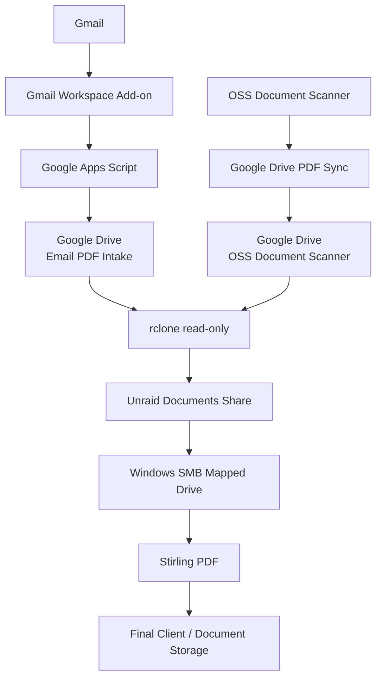
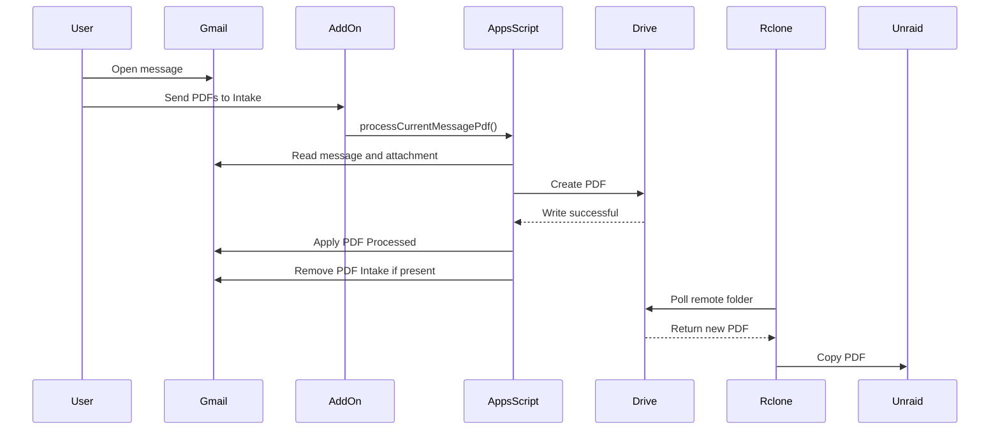
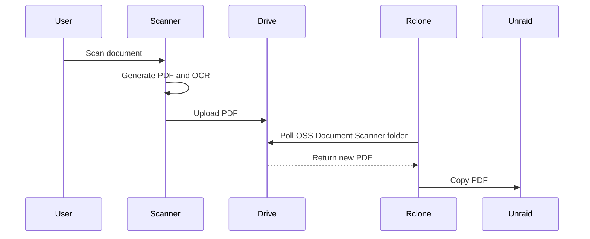

# Architecture

This document describes the structure and trust boundaries of the Stirling document workflow.

---

# High-Level Design

The system has two intake paths:

1. Gmail PDF attachments
2. Mobile document scans

Both paths converge on Google Drive, which is used only as a transport layer. Unraid then pulls documents down using rclone.



---

# Component Responsibilities

Each component has one narrow responsibility.

| Component | Responsibility |
|---|---|
| Gmail | Receives email documents |
| Gmail Workspace Add-on | Provides the user-facing intake button |
| Google Apps Script | Extracts PDFs and manages Gmail labels |
| OSS Document Scanner | Captures and OCRs scanned documents |
| Google Drive | Temporary transport layer |
| rclone | Pulls documents from Drive |
| Unraid | Persistent document archive |
| SMB | Exposes archived documents to Windows |
| Stirling PDF | Performs on-demand PDF manipulation |
| Final client storage | Stores completed business documents |

---

# Gmail Intake Path

```text
Gmail message
    ↓
Open Email PDF Intake add-on
    ↓
Send PDFs to Intake
    ↓
Apps Script reads PDF attachment
    ↓
Apps Script writes PDF to Google Drive
    ↓
PDF Processed label applied
    ↓
rclone pulls PDF to Unraid
    ↓
Windows accesses PDF through SMB
    ↓
Stirling processes PDF if needed
```

The Gmail message is not marked processed until the Drive write succeeds.

---

# Gmail Fallback Path

The manual Gmail label:

```text
PDF Intake
```

provides a fallback path.

```text
Apply PDF Intake label
    ↓
Apps Script timer trigger
    ↓
processPdfIntake
    ↓
Copy PDF to Google Drive
    ↓
Remove PDF Intake
    ↓
Apply PDF Processed
```

The timer runs every minute.

---

# Scanner Intake Path

```text
Scan document
    ↓
OSS Document Scanner
    ↓
Local PDF generation
    ↓
OCR
    ↓
Google Drive PDF Sync
    ↓
Google Drive: OSS Document Scanner
    ↓
rclone
    ↓
Unraid
    ↓
Windows SMB
    ↓
Stirling PDF
```

The phone does not communicate directly with Unraid.

---

# Trust Direction

A key design decision is that Unraid does not accept inbound document-transfer connections from the Internet.

Instead:

```text
Internet-facing services
        ↓
Google Drive
        ↓
Outbound pull by Unraid
        ↓
Local archive
```

This reduces the attack surface of the local environment.

---

# Google Drive as Transport

Google Drive is intentionally not treated as the authoritative archive.

Its purpose is to bridge:

```text
Gmail
Mobile scanner
        ↓
Google Drive
        ↓
Unraid
```

Once a PDF is copied locally, the Unraid copy becomes independent of later cloud deletion.

---

# rclone Security Boundary

The rclone remote uses:

```text
drive.readonly
```

This means Unraid can read from Google Drive but cannot modify or delete cloud content.

The design intentionally avoids giving the local server broader permissions than required.

---

# Apps Script Security Boundary

Apps Script uses:

```text
drive.file
gmail.modify
gmail.addons.execute
gmail.addons.current.message.readonly
```

`drive.file` limits Drive access to files and folders created or used by the application.

`gmail.modify` is required because the workflow must both read attachments and modify labels.

---

# Archival Behavior

The transfer mechanism uses:

```bash
rclone copy
```

instead of:

```bash
rclone sync
```

The desired behavior is:

```text
Cloud file exists
      ↓
Copied locally
      ↓
Cloud file later deleted
      ↓
Local copy remains
```

This prevents cloud-side cleanup from deleting archived local documents.

---

# Unraid Storage

The persistent local archive is:

```text
/mnt/user/Documents
```

with intake folders:

```text
/mnt/user/Documents/Email PDF Intake
/mnt/user/Documents/OSS Document Scanner
```

These folders are exposed over SMB to the Windows workstation.

---

# Stirling's Role

Stirling PDF is deliberately downstream of the archive.

It does not control intake.

It does not own original documents.

It does not act as the authoritative repository.

Its role is:

```text
Input PDF
   ↓
On-demand manipulation
   ↓
Finished PDF
```

Typical operations include:

```text
Merge
Split
Reorder pages
Remove pages
OCR
Compress
Redact
Sign
Watermark
Edit metadata
Convert
Extract
```

---

# Failure Boundaries

The architecture is modular enough that each failure can usually be isolated to one segment.

## Gmail-side failure

```text
Gmail
↓
Apps Script
↓
Drive
```

## Cloud-to-local failure

```text
Drive
↓
rclone
↓
Unraid
```

## Workstation access failure

```text
Unraid
↓
SMB
↓
Windows
```

## PDF-processing failure

```text
Windows
↓
Stirling
```

A Stirling failure should not affect document intake or archival storage.

---

# Sequence: Gmail Button Workflow



---

# Sequence: Scanner Workflow



---

# Design Principles

The architecture follows several principles:

- narrow component responsibilities;
- no public Stirling endpoint;
- no inbound Unraid upload service;
- read-only Drive access from Unraid;
- restricted Drive access from Apps Script;
- no cloud-to-local deletion propagation;
- local archival independence;
- source documents preserved before manipulation;
- PDF processing separated from storage;
- recovery possible at each individual layer.

The resulting workflow remains understandable because each component performs one specific job.
